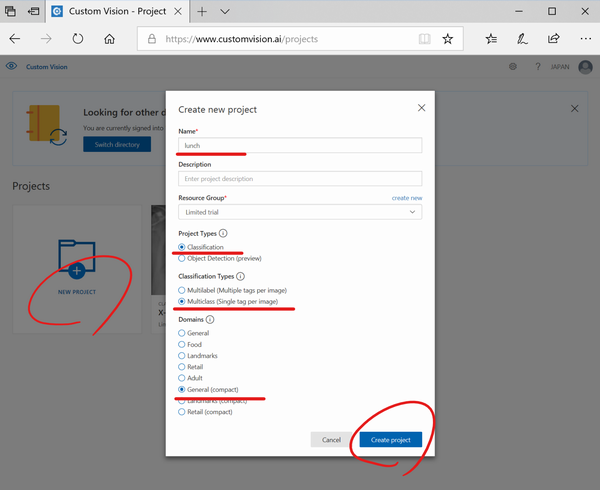
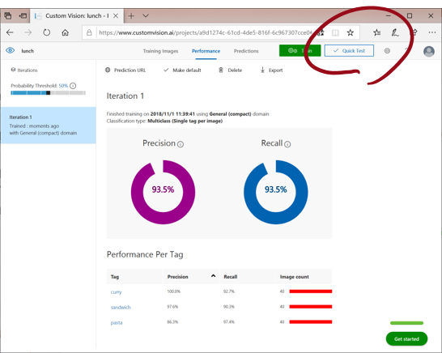
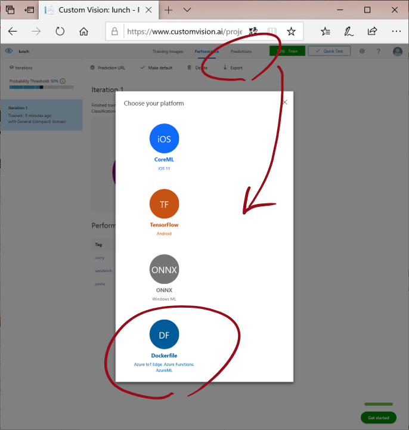

# 2. 画像の学習＆モデル作成
Azure Cognitive ServiceのCustom Visioを使うと、ブラウザからオリジナル画像のアップロードを行うだけで、TensorFlowの学習済みモデル(pb)とDockerfileなどを自動生成できます。

手順は、次の通りです。

## 2.1 教師データのダウンロード＆解凍
ここをクリックしてダウンロードします。zip形式で圧縮していますので、解凍してください。

[](https://raw.githubusercontent.com/asashiho/ContainerDays1812/master/dataset.zip)

なお、すでに学習用の教師データをお持ちの方は、そちらを使ってもかまいません。

## 2.2 Custom Vision にサインイン

Azure Custom Visionにアクセスし、[SIGN IN]します。サインインには、Microsoftアカウントが必要です。

https://www.customvision.ai/


トライアルで使用するかどうかを聞かれますので
[ Continue with trial ] 
を選びます。トライアルでは2つのプロジェクトまで作成できます。


## 2.3 プロジェクトの作成

ログイン出来たら、［New Project］をクリックし、以下の通り新規プロジェクトを作成します。

|    項目                    |    設定値                                  |
|----------------------------|--------------------------------------------|
|    Name                    |    lunch                                   |
|    Project Types           |    Classification                          |
|    Classification Types    |    Multiclass (Single tag per image)       |
|    Domains                 |    General (compact)                       |




## 2.4 画像のアップロード
学習に使う画像をアップロードします。
解凍したデータセットの「lunch」を選んでください


## 2.5 教師データのタグ付け
次に、データセット「lunch」含まれる教師データに
* Curry
* Pasta
* Sandwich

それぞれタグをつけてアップロードします。このタグが、画像認識の結果になります。


すべての教師データのタグ付けができると、各40枚の画像×3種類がアップロードできたことになります。

## 2.6 学習
学習データの準備ができたら、[ Train ] をクリックすると学習が始まります

教師データを変えたり、枚数を増やしたりして、精度を上げてください


[ QuickTest ]で推論結果を試すこともできます



## 2.7 モデルのエクスポート
次に、学習したモデルを[ Export ] をクリックして、ダウンロードします

今回はKubernetesで動かすため[ Dockerfile ]
を選びます



エクスポートすると、Dockerfile／Tensorflowのモデルファイル／Predictionを行うためのPythonのアプリが自動生成され、Zipファイルにまとめてダウンロードできます。なお、コンテナのタイプはLinuxとWindowsが選べますが、今回は「Linux」としてください。


同様の手順で新規プロジェクトを作成し、デザートメニューを認識する「dessert」を作成してください。この「dessert」では
* chocolate
* soft cream
* strawberry cake

を分類します。

ここで作成したバージョンの異なる2つの画像認識アプリをダウンロードして、ハンズオンのバックエンドアプリとしてそのまま利用します。

* xxxxxxx.DockerFile.Linux.zip
* yyyyyyy.DockerFile.Linux.zip

なおCustom Visionは、トライアルの場合2つまでしかProjectを作成できません。

>[Azure Custom Vision 公式サイト](https://azure.microsoft.com/ja-jp/services/cognitive-services/custom-vision-service/)


## 2.8 画像認識アプリのCloud Shellへアップロード

手順2で作成した画像認識アプリをAzure Cloud Shellにアップロードします。zipファイルをブラウザにドラッグ＆ドロップすると、アップロードできます。


バージョンの異なる2種類の画像認識アプリをどちらもアップロードしてください


## 2.9 画像認識アプリの解凍

アップロードしたzip形式の画像認識アプリを、Cloud Shell上で解凍します。

```bash
$ unzip xxxxxxx.DockerFile.Linux.zip -d ContainerDays1812/lunch_recognition

$ unzip xxxxxxx.DockerFile.Linux.zip -d ContainerDays1812/dessert_recognition
```
これで、Custom Visionを使った画像認識アプリがコンテナで利用できます。
